PollSphere 🚀

A full-stack realtime polling and analytics platform where users can create interactive polls, collect responses, analyze audience insights and publish public results with live updates.

Built using the MERN Stack with Socket.IO for realtime analytics and a premium SaaS-inspired UI.

✨ Features

🔐 Authentication
User Registration & Login
JWT Authentication
Protected Routes

🗳 Poll Management
Create dynamic polls
Add multiple questions
Single-option voting system
Mark questions as required/optional
Set correct answers
Poll expiry system
Delete polls
Public poll sharing

👥 Response System
Anonymous responses
Authenticated responses
Public poll sharing
Validation for required questions
Score calculation

📊 Analytics Dashboard
Realtime response updates using Socket.IO
Poll analytics dashboard
Response distributions
Pie Charts & Bar Graphs
Winning option highlighting
Engagement metrics
Live streaming indicators

🌍 Public Result Publishing
Publish final poll results
Publicly accessible analytics pages
Shared result dashboards

🎯 Quiz Features
 Score calculation
 Correct answer validation
 Expired poll handling
 Required question validation


📱 Sharing Features
 QR code generation for polls
 Copy-to-clipboard poll links
 Public poll URLs

🎨 UI/UX
Premium SaaS-inspired design
Glassmorphism effects
Responsive layouts
Gradient aesthetics
Realtime visual feedback
Modern dashboard experience

🛠 Tech Stack
Frontend
React.js
React Router DOM
Tailwind CSS
Recharts
Socket.IO Client
Axios
Backend
Node.js
Express.js
MongoDB
Mongoose
Socket.IO
JWT Authentication

⚡ Realtime Features
Live participant tracking
Live response updates
Instant analytics refresh
Socket.IO powered streaming
Realtime engagement tracking

📸 Screenshots

Home page
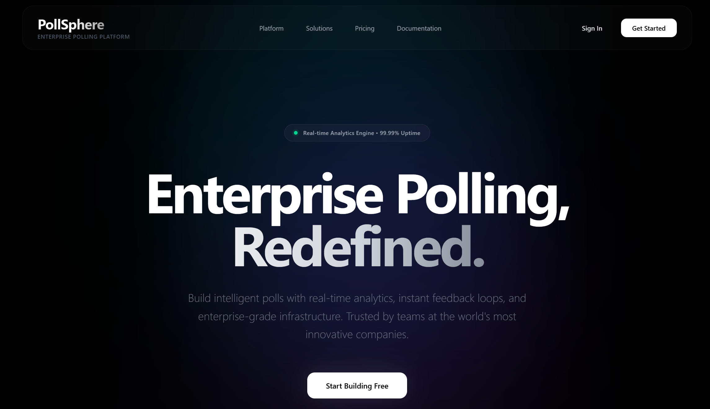
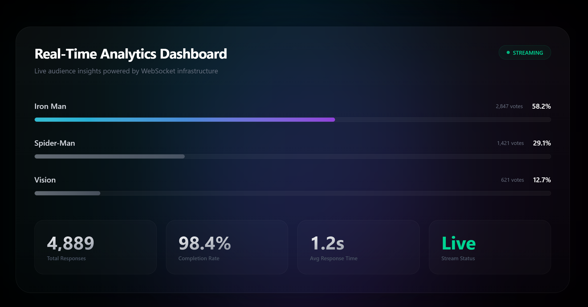
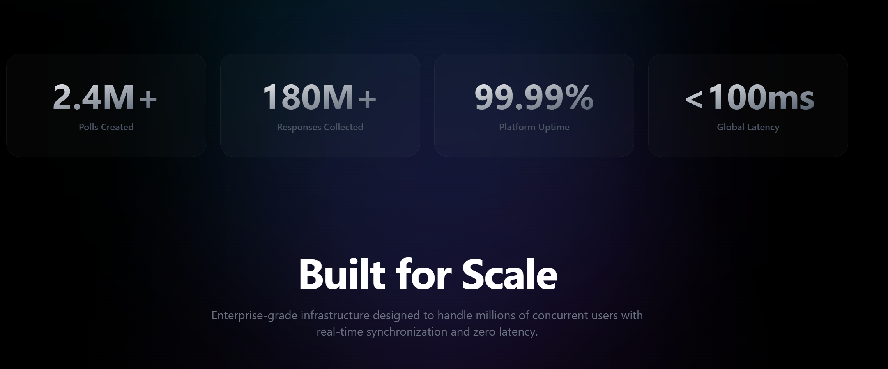
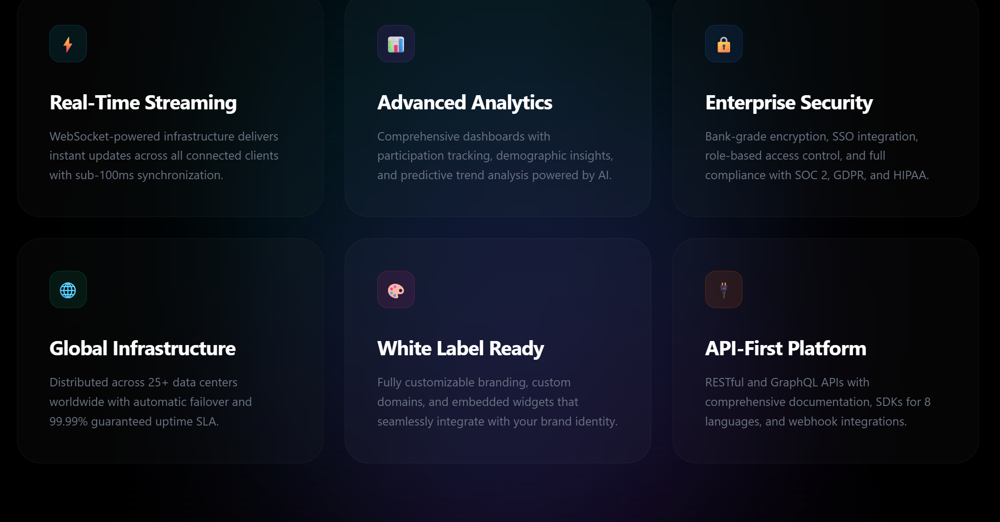
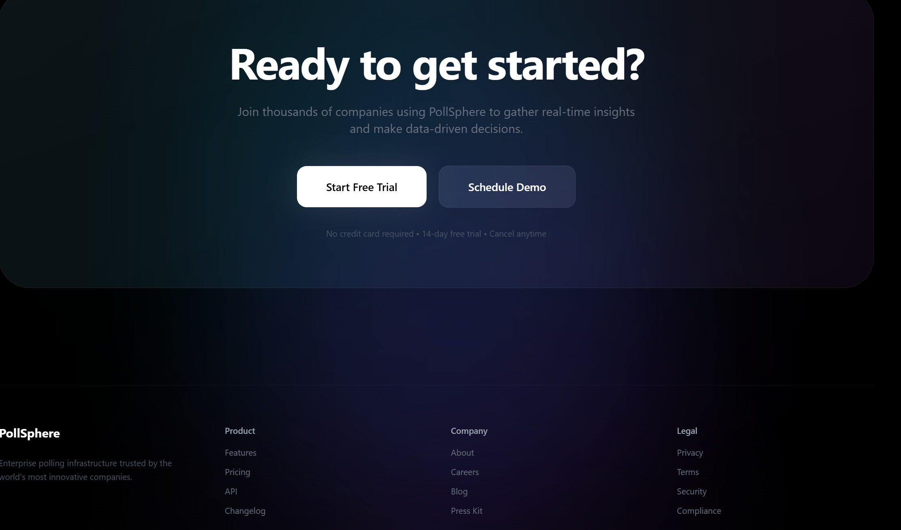

LogIn page
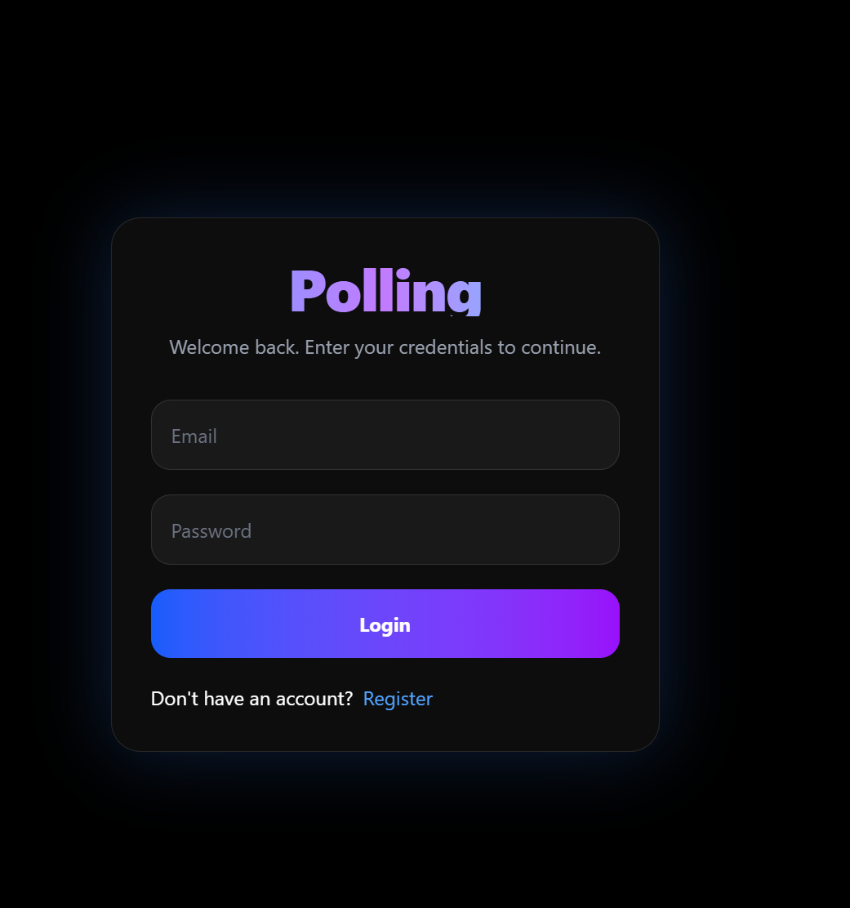

Register page
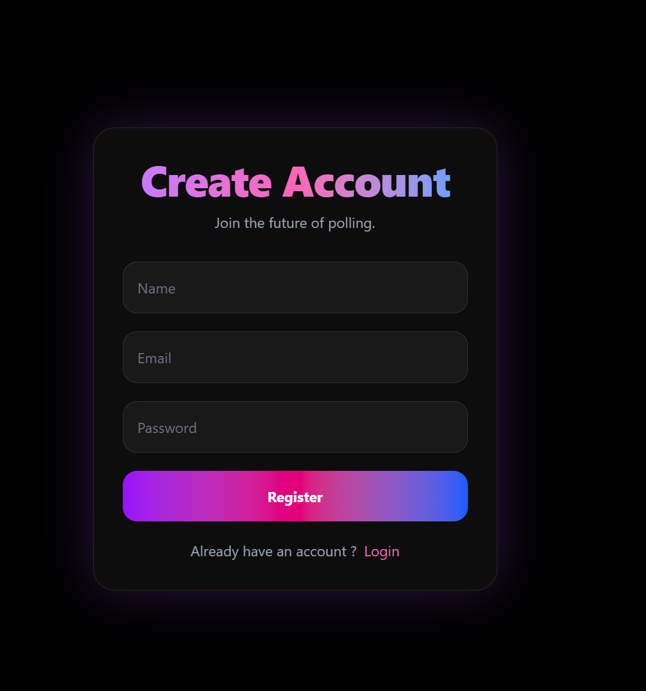

Dashboard page
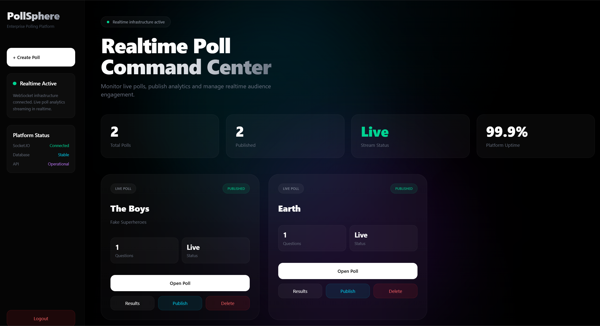

Create Poll page
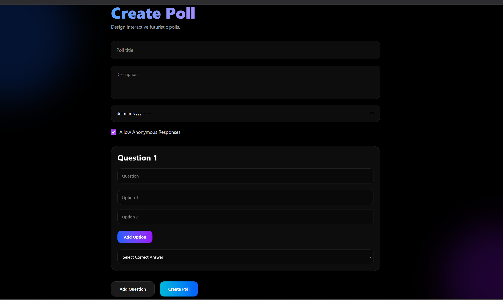

Open live Poll page
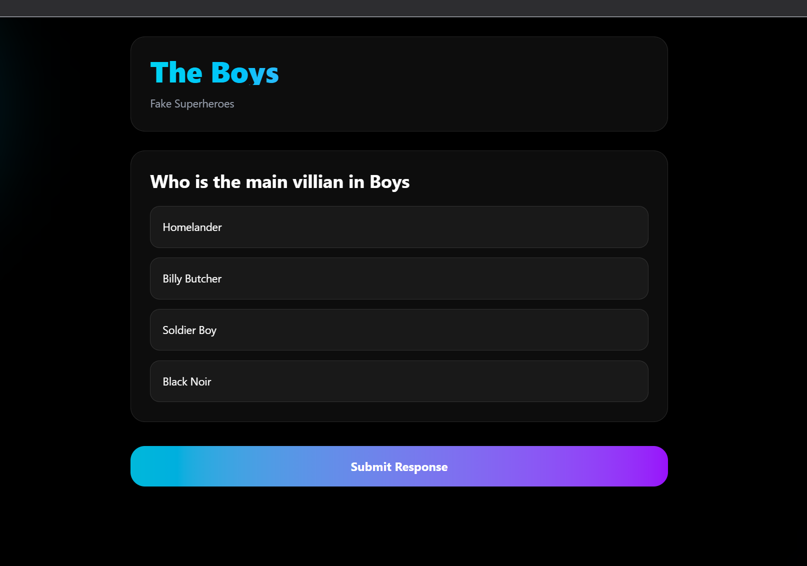

Open Expired Poll page
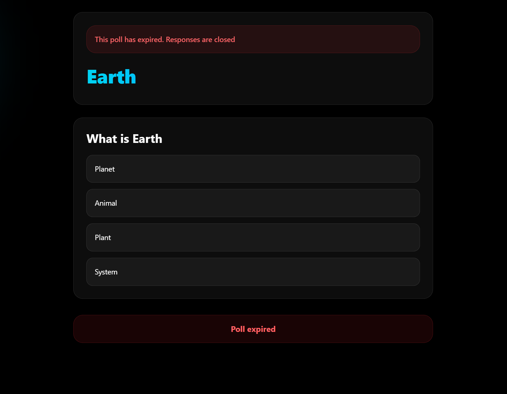

Result Live Poll page
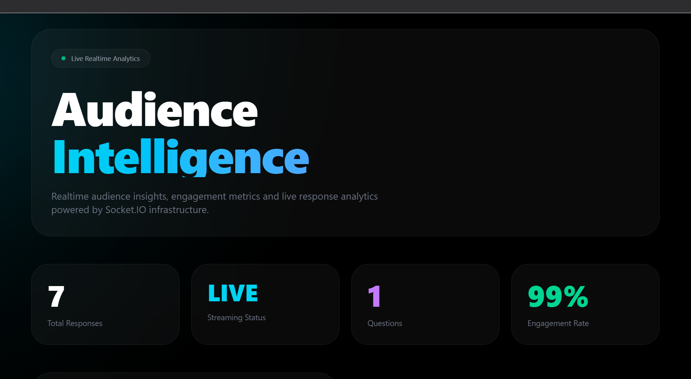
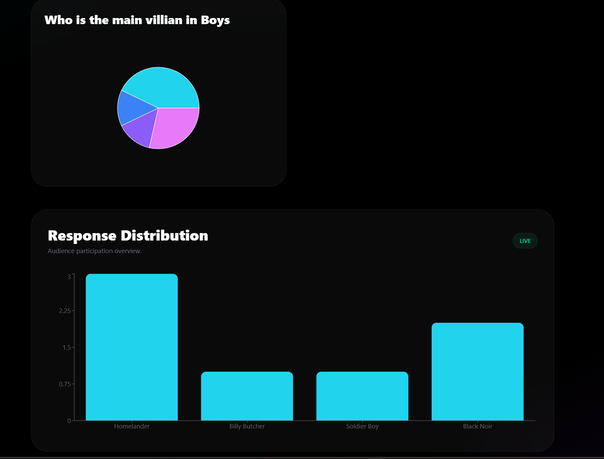
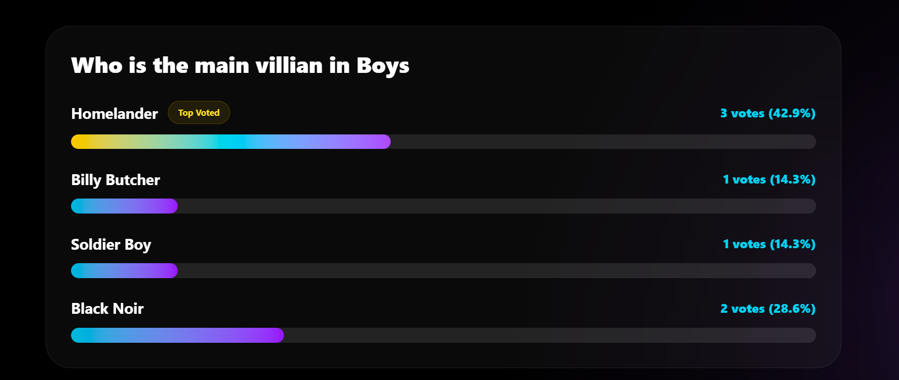

Result Expired Poll page
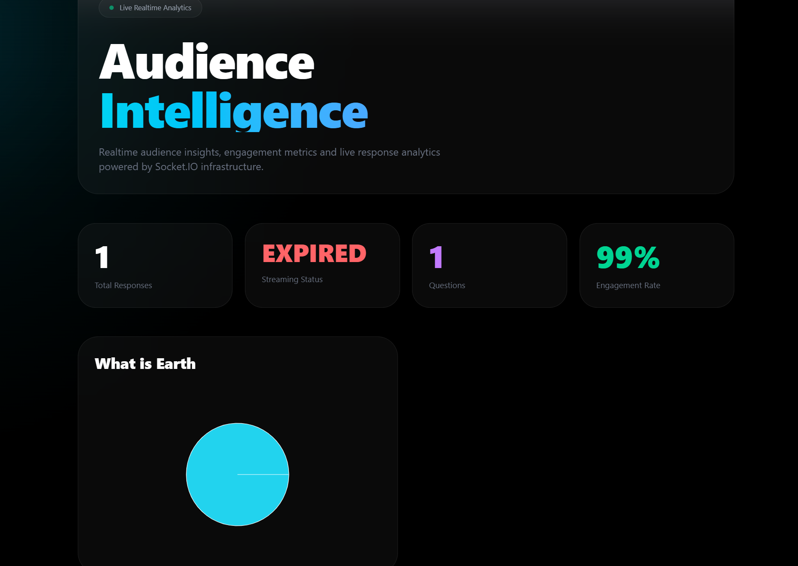
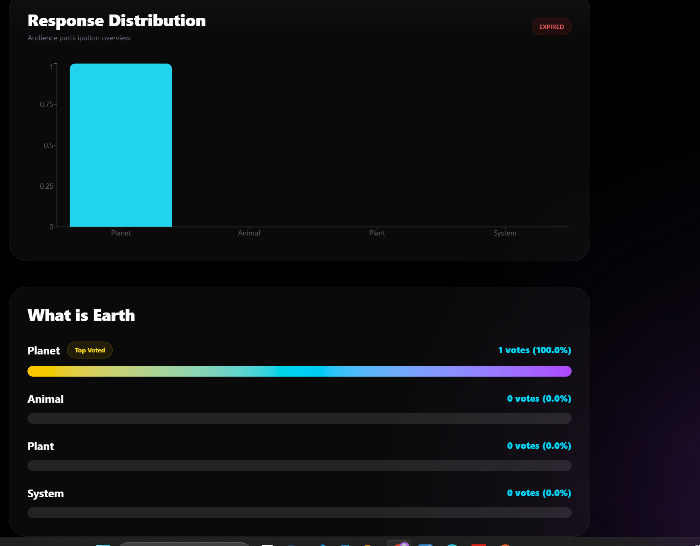

🚀 Installation
Clone Repository
git clone https://github.com/armaangarg73/Polling-system

# 📂 Project Structure

```txt
client/
 ├── src/
 ├── pages/
 ├── services/
 ├── routes/

server/
 ├── controllers/
 ├── routes/
 ├── models/
 ├── middleware/
```

🖥️ Future Improvements
Framer Motion animations
Advanced analytics
Team collaboration
AI-generated insights
Poll templates
Dark/Light themes
Export analytics as PDF

# 👨‍💻 Author

**Armaan Garg**

Built with realtime systems, analytics, and modern SaaS design principles.

GitHub:

https://github.com/armaangarg73

---

⭐ If you found this project interesting, consider giving it a star.
